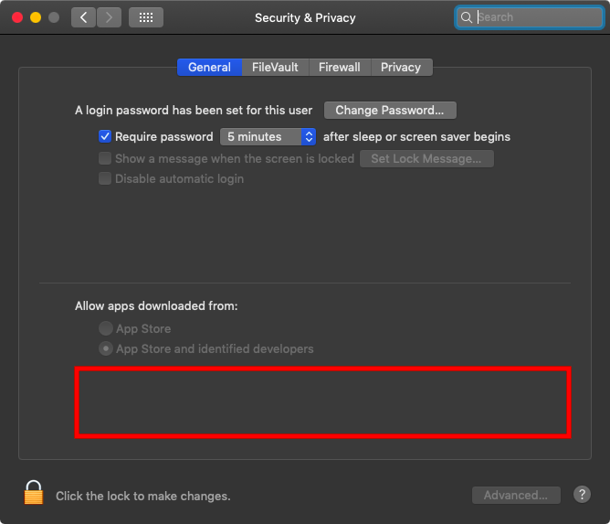
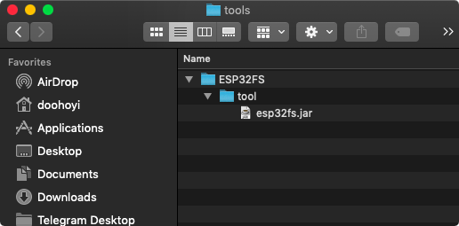

:title: Soilpunk technical rider
:author: Heerko van der Kooij
:description: 
:css: slides.css

.. header::

  Soilpunk 🌏🤘 - technical rider 

----

Solarpunks 
==========
hardware setup
=========================

In these slides we'll guide you to installing, setting-up and uploading the HTML files to the ESP32 modules. 
We've already uploaded the correct firmware on the modules, so we're focussing just on getting the HTML on there. 

This document is also viewable as `plain text <https://github.com/hackersanddesigners/Soilpunk_technical_setup/blob/master/slides.rst>`_

We will following these steps, some are optional:

#. `Installing the Arduino IDE <#arduino>`_
#. `Installing support the ESP32 boards in the Arduino IDE. <#espboards>`_
#. `Installing a driver for the ESP32 boards. <#espdriver>`_
#. `Installing a plugin to upload the HTML to the board <#spiffs>`_

----

:id: arduino

Download the Arduino IDE
========================

:id: the-slide-id

`Download the Arduino IDE <https://www.arduino.cc/en/Main/Software>`_

----

Install the Arduino IDE
=======================

* `Windows <https://www.arduino.cc/en/Guide/Windows>`_
* `Mac <https://www.arduino.cc/en/Guide/MacOSX>`_
* `Linux <https://www.arduino.cc/en/Guide/Linux>`_

----

:id: espboards

Add ESP32 boards
================

Adding ESP32 boards to the Arduino IDE's board list.

Open the Arduino Preferences under Edit > Preferences (Linux and Windows), or Arduino > Preferences (Mac).

Copy and paste the following into 'Additional Boards Manager URLs' and click 'Ok'.

.. image:: ./assets/images/arduino-board-url.png

``https://dl.espressif.com/dl/package_esp32_index.json``

----

Launch the Board Manager
========================

.. image:: ./assets/images/arduino-board-manager.png
.. class:: substep
.. image:: ./assets/images/arduino-board-manager-popup.png

----

Search for ESP32
========================

And click "**Install**"

----

:id: espdriver

Install the ESP32 driver
========================

Installing a USB device driver to communicate with the ESP32 module (chip name: SiliconLabs CP2012)

#. `On Linux <#/driverlinux>`_
#. `On Windows <#/driverwindows>`_
#. `On On MacOs <#/drivermac>`_

----

:id: driverlinux

Linux driver
============

Linux 3.x.x & 4.x.x
*******************

* Driver installation not required (included in kernel)

	* `udev rules update required <https://docs.platformio.org/en/latest/faq.html#platformio-udev-rules>`_

	* `99-platformio-udev.rules <https://raw.githubusercontent.com/platformio/platformio-core/develop/scripts/99-platformio-udev.rules>`_

Linux 2.6.x
***********

* `Linux 2.6.x <https://www.silabs.com/documents/login/software/Linux_2.6.x_VCP_Driver_Source.zip>`_ - No information

Restart your computer.

[`continue →→→ <#/checkdriver>`_ ] 

----

:id: driverwindows

Windows driver
==============

* `Windows 10 <https://www.silabs.com/documents/public/software/CP210x_Universal_Windows_Driver.zip>`_
* `Windows 7/8/8.1 <https://www.silabs.com/documents/public/software/CP210x_Windows_Drivers.zip>`_
* `Installation process <https://www.pololu.com/docs/0J7/all>`_

Restart your computer.

[`continue →→→ <#/checkdriver>`_  ] 

----

:id: drivermac

Mac driver
============

Download the driver: `Silabs USB communication chip driver download <https://www.silabs.com/products/development-tools/software/usb-to-uart-bridge-vcp-drivers>`_

For very old versions of MacOS (Yosemite/10.10.x) a legacy driver must be installed, instead normal one.
`Download Legacy SiLabs driver <https://www.silabs.com/community/interface/forum.topic.html/latest_vcp_driverfo-96RK>`_

Doubleclick "Install CP210x VCP Driver.app" to install it.

When it gives a security message, follow the instructions to allow the install to continue.

Restart your computer.

----

Gatekeeper (MacOS)
==================

After restarting, make sure GateKeeper does not interfere with driver loading.

  * System Preferences -> Security & Privacy -> General

.. image:: ./assets/images/gatekeeper-check.png

----

:data-x: r0
:data-y: r1000

Gatekeeper (MacOS)
==================

If there is an error message in the red box area, GateKeeper is interrupting the driver's operation. If this is the case, click 'Allow' and confirm with administrator password, then restart your computer.

----

:data-x: r1500
:data-y: r-1000

:id: checkdriver

Check driver
============

After starting the Arduino IDE, make sure it can communicate with the ESP32 module

If communication is possible, there should be a new entry in the port list as shown in the picture below.
On MacOS it will be called something like /dev/cu.SLAB_USBtoUART for other OSes this name might be different.

.. image:: ./assets/images/arduino-esp32-comm.png

----

:data-y: r0

Install SPIFFS plugin
=====================

The content of the small webpage we will put on the wifi modules is stored separately from the running code that takes care of publishing it. Therefore, it goes through a separate process from the usual Arduino IDE code upload process. To do this, you need to install a separate extension plug-in.

----

Download and install `the ESP32FS plug-in <https://github.com/me-no-dev/arduino-esp32fs-plugin/releases>`_

Then create a folder called:

* ``<home_dir>/Arduino/tools`` (Windows/Unix)
* ``~/Documents/Arduino/tools`` (MacOS)

.. image:: ./assets/images/arduino-esp32fs-00002.png
  :alt: Screenshot of finder window open at Arduino, showing subfolders Tools

----

Copy unpacked ESP32FS into the subfolder tools

.. image:: ./assets/images/arduino-esp32fs-00003.png
  :alt: Screenshot of finder window open at tools with subfolder ESP32FS 

----

Be mindful with the construction of the folders. It should be installed as shown in the following figure. (Note also that the folder name is ESP32FS!)

----

After restarting the Arduino IDE, verify that the plug-in installation was successful. If successful, you will see a menu called ``ESP32 Sketch Data Upload`` added.

.. image:: ./assets/images/arduino-esp32fs-00005.png
  :alt: Screenshot of Arduino window with menu open at - Tools - ESP32 Sketch Data Upload

----

Make sure you have the WifiZineThrowie sketch open. When you click the ``ESP32 Sketch Data Upload`` menu option, it will move all the files in the ``/data`` folder to the ESP32 module's web page store.

